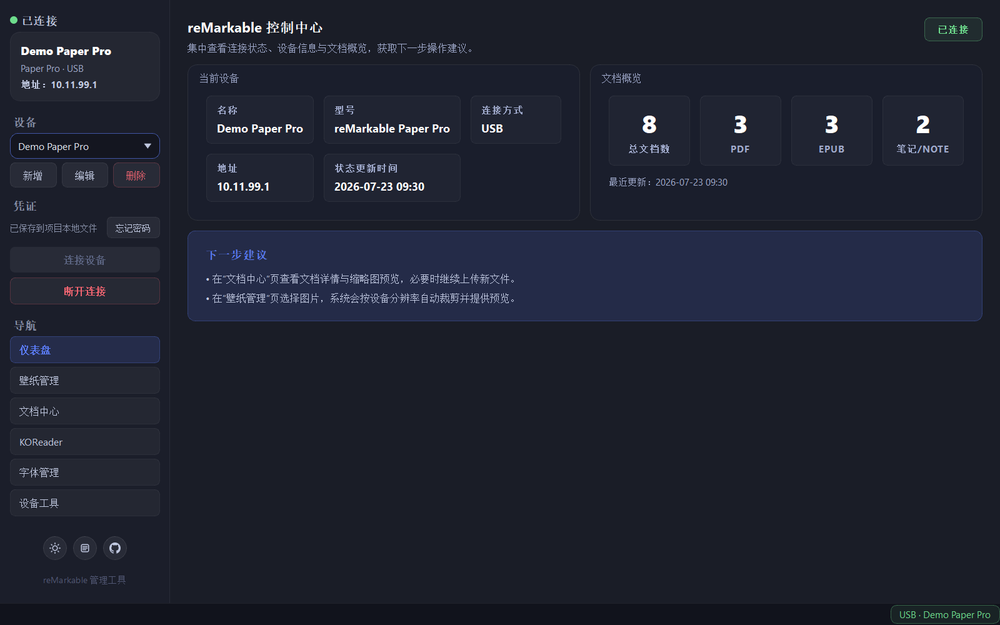
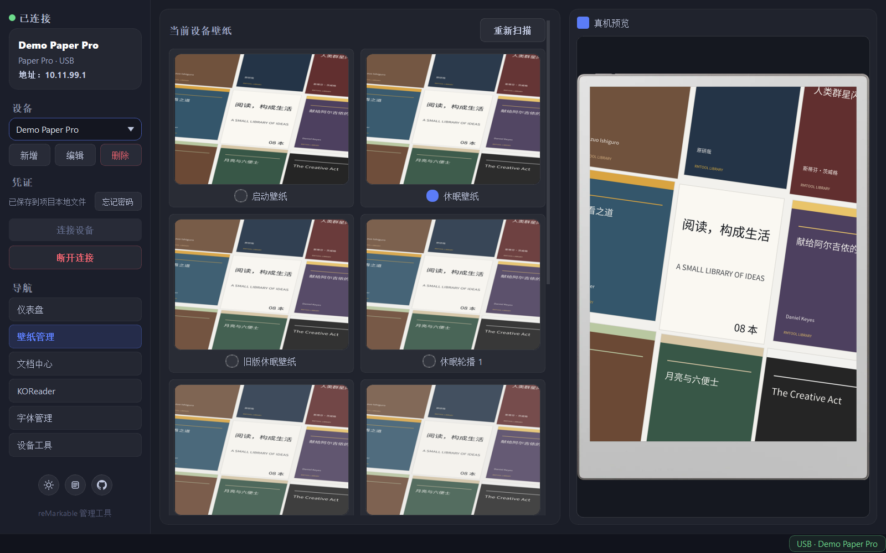
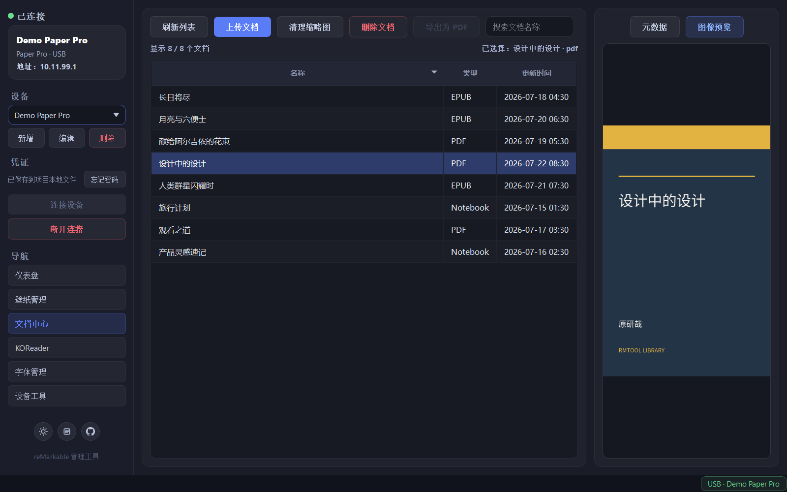
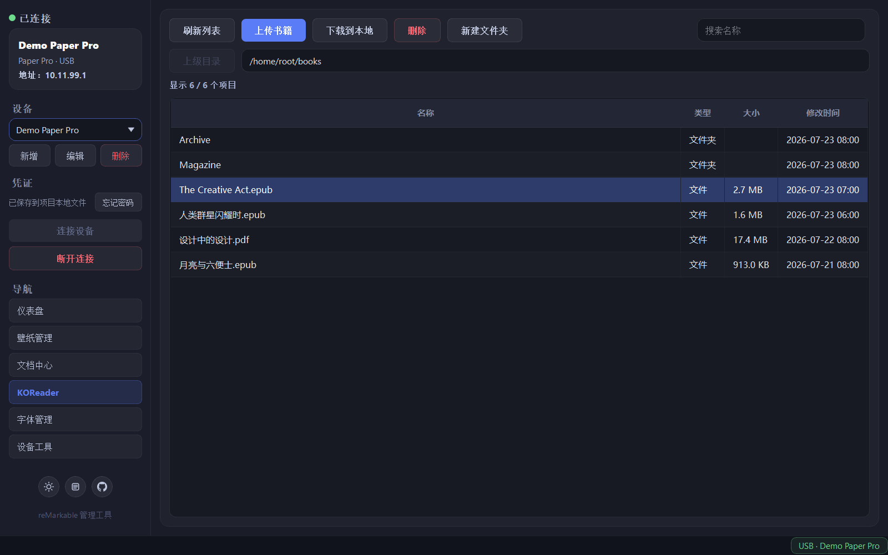
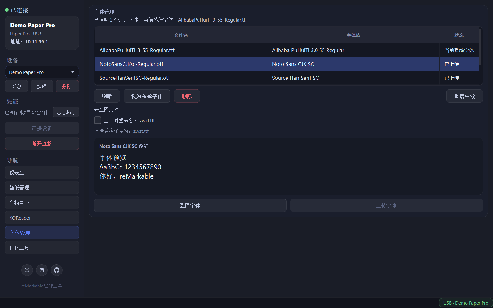
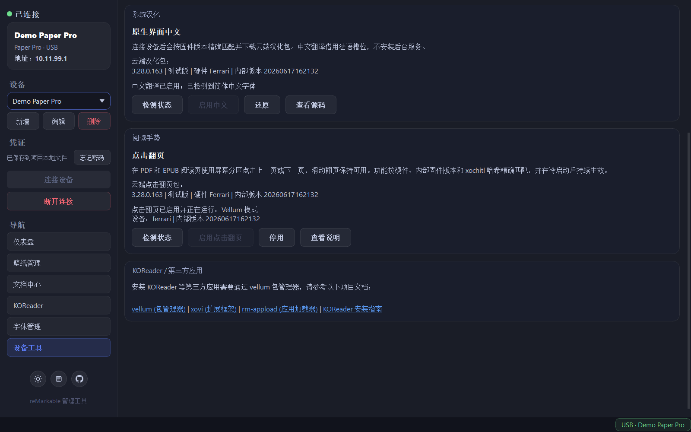

**[English](README.md) | 简体中文**

<div align="center">


# rmtool

面向 reMarkable 的桌面图形化管理工具

</div>

rmtool 通过本地 root SSH 管理 reMarkable Paper Pro、Paper Pro Move、Paper Pure、reMarkable 1 和 reMarkable 2，提供多设备连接、仪表盘、壁纸、文档、KOReader 书库管理、字体、时间、设备控制、原生界面中文和按固件精确匹配的点击翻页等功能。设备操作不依赖 reMarkable 云服务；首次获取汉化清单或固件包时需要电脑联网，已有有效缓存时可离线复用。

> [!WARNING]
> rmtool 会直接修改设备文件。请先同步或备份重要内容，并确认自己能够承担开发者模式、root SSH 和第三方修改带来的数据与保修风险。本项目不是 reMarkable 官方软件。

## 软件截图

<table>
  <tr>
    <td width="50%" align="center">
      <a href="assets/screenshots/01-dashboard.png"></a><br>
      <sub><b>仪表盘</b></sub>
    </td>
    <td width="50%" align="center">
      <a href="assets/screenshots/02-wallpaper.png"></a><br>
      <sub><b>壁纸管理</b></sub>
    </td>
  </tr>
  <tr>
    <td width="50%" align="center">
      <a href="assets/screenshots/03-documents.png"></a><br>
      <sub><b>文档中心</b></sub>
    </td>
    <td width="50%" align="center">
      <a href="assets/screenshots/04-koreader.png"></a><br>
      <sub><b>KOReader 书库</b></sub>
    </td>
  </tr>
  <tr>
    <td width="50%" align="center">
      <a href="assets/screenshots/05-fonts.png"></a><br>
      <sub><b>字体管理</b></sub>
    </td>
    <td width="50%" align="center">
      <a href="assets/screenshots/06-toolbox.png"></a><br>
      <sub><b>设备工具箱</b></sub>
    </td>
  </tr>
</table>

## 下载与安装

普通用户建议直接使用 [最新 Release](https://github.com/pretenderlu/rmtool/releases/latest)，无需安装 Python。

| 平台 | 下载 | 说明 |
| --- | --- | --- |
| Windows x64 | [便携版 ZIP](https://github.com/pretenderlu/rmtool/releases/latest/download/rmtool-windows-x64.zip) | 解压后运行 `rmtool/rmtool.exe`，适合长期使用 |
| Windows x64 | [单文件 EXE](https://github.com/pretenderlu/rmtool/releases/latest/download/rmtool-windows-x64-onefile.exe) | 直接运行；首次和每次冷启动会稍慢 |
| macOS ARM64 | [Apple Silicon 应用](https://github.com/pretenderlu/rmtool/releases/latest/download/rmtool-macos-arm64.app.zip) | 仅支持 M 系列 Mac；解压后运行 `rmtool.app` |

发布包目前没有 Windows 代码签名或 Apple 公证。若 SmartScreen 或 Gatekeeper 阻止启动，请先核对文件确实来自本仓库 Release，再使用系统提供的单次放行方式；不要全局关闭系统安全保护。

macOS 版会把运行状态保存在 `~/Library/Application Support/rmtool/`，因此即使应用包位于只读或系统转移的位置，也能正常保存配置。

## 连接设备

### SSH 前置条件

- 设备必须允许使用 `root` 账户通过 SSH 登录，并能查看当前 root 密码。
- Paper Pro、Paper Pro Move 和 Paper Pure 需要先启用 Developer Mode。启用会执行恢复出厂设置、清除设备上的本地数据并削弱设备安全性，请先同步或备份；具体流程与风险见 [reMarkable 官方说明](https://developer.remarkable.com/documentation/developer-mode)。reMarkable 1 和 reMarkable 2 不使用 Developer Mode，但仍需可用的 root SSH。
- USB 连接的默认地址是 `10.11.99.1`。设备通过 USB 接入电脑后，选择 USB 模式即可连接。
- Wi-Fi SSH 默认关闭。请先通过 USB 连接，再到“设备工具箱 > 设备控制”点击“开启 Wi-Fi SSH 通道”，随后把设备配置改为 WLAN 地址。
- Paper Pro 上的 root 用户名和密码可在 `General > Help > About > Copyrights and Licenses` 查看；其他型号或固件请以设备当前界面为准。

### 首次连接

1. 启动 rmtool，点击左侧“新增”，填写设备名称、连接方式、地址、型号和 root 密码。
2. 点击“连接”。首次连接会显示 SSH 主机指纹；确认是自己的设备后再选择信任。
3. 连接成功后，壁纸、文档、KOReader 和工具箱页面会自动启用。
4. 多台设备可以分别保存配置；切换到不同设备或地址时，现有 SSH 连接会自动断开。

## 本地数据与安全

rmtool 按运行平台将状态保存在以下目录：

| 运行方式 | 状态目录 |
| --- | --- |
| 源码运行 | 仓库根目录下的 `.rmtool/` |
| Windows 发布包 | `rmtool.exe` 或单文件 EXE 同级的 `.rmtool/` |
| macOS 发布包 | `~/Library/Application Support/rmtool/` |

主要文件包括：

- `devices.json`：设备列表、当前设备、主题、路径和日志面板设置。
- `known_hosts`：按设备 ID 隔离保存的 SSH 主机信任记录。
- `remarkable_tool.log`：滚动运行日志。
- `cache/localization/`：已校验的汉化清单和固件包缓存。
- `cache/tap-page-turn/`：已校验的点击翻页清单和固件包缓存。

> [!CAUTION]
> 勾选“记住密码”后，root 密码会以**明文**写入上述状态目录中的 `devices.json`，不会进入系统凭据库。请勿分享、上传或把整个状态目录同步到不受信任的位置；提交 Issue 时也不要附带该目录。可在左侧点击“忘记密码”删除已保存密码。

## 当前功能

- **连接与仪表盘**：管理多个 USB/Wi-Fi 设备配置，校验 SSH 主机指纹；原生 Qt 仪表盘显示连接状态、设备信息、PDF/EPUB/笔记数量和下一步建议。
- **壁纸管理**：读取设备现有启动、休眠、轮播和关机壁纸预览；当前界面只按所选设备的原生分辨率生成竖屏壁纸，支持留白、裁剪和拉伸，裁剪时可调整水平/垂直偏移；还可把选中的文档缩略图配合可选文案，在电脑本地排版为封面墙壁纸，不会把文档数据发送到云端。
- **文档中心**：搜索和查看文档元数据、缩略图；批量上传 PDF/EPUB、检查剩余空间、批量删除；将单个文档中 `.rm` 或 `.note` 内可解析的手写笔迹导出为白底 PDF，不合并原 PDF/EPUB 页面。
- **KOReader 文件管理**：检测设备上已有的 KOReader 并浏览其书库；可搜索目录、上传或下载书籍、新建文件夹和删除项目，所有操作都限制在检测到的书库根目录内。rmtool 本身不负责安装 KOReader。
- **字体管理**：预览并上传多个 TTF/OTF，可在上传时重命名为 `zwzt.ttf`；查看设备用户字体目录顶层文件，按精确文件路径切换系统界面字体，并删除未启用字体。上传不会自动切换字体或重启设备，重启由独立确认按钮执行。
- **时间管理**：同步电脑时间、查看系统时间/硬件时钟/时区，或设置为 `Asia/Shanghai`。
- **设备控制**：重启设备、开启 Wi-Fi SSH，以及为具有 `rm_frontlight` 前光接口的设备提升亮度并安装持久化服务。
- **点击翻页**：在精确支持的固件上，为 PDF/EPUB 阅读页启用持久化的左右点击区域，同时保留原生滑动翻页和文档链接。
- **主题与日志**：亮色/暗色主题会持久化；底部日志面板支持级别过滤、暂停、自动滚动、清屏和打开日志文件。
- **第三方应用入口**：工具箱提供 vellum、xovi、rm-appload 和 KOReader 的文档链接，不包含一键安装器。

### 壁纸注意事项

每次上传前，目标文件会复制为同目录的 `.backup`；再次上传会覆盖该备份。上传休眠壁纸 `suspended.png` 时，可让程序把设备现有 `carousel/*.png` 替换为透明图片，避免固件 3.27 的轮播插图遮挡自定义壁纸。轮播原图会首次备份到固件不会读取的 `carousel/.backup/` 子目录；关闭该选项时会从备份恢复，旧版本遗留在原图旁的备份也会迁移到该子目录。

### 原生界面中文

发布包不内置任何固件专用 `.qm` 文件。点击“设备工具箱 > 系统汉化 > 检测状态”后，rmtool 会：

1. 从固定的 `localization-assets` Release 获取清单，并在网络不可用时尝试已验证的本地缓存。
2. 按 `/etc/version` 的 14 位内部固件版本精确匹配。
3. 对设备原始法语载体文件 `reMarkable_fr.qm` 计算 SHA-256，据此选择对应硬件载荷；`chiappa`、`ferrari`、`tatsu`、`rm1`、`rm2` 等平台名仅用于显示，不用于猜测兼容性。
4. 校验下载大小和 SHA-256。固件、原始法语文件或校验值不匹配时，不会写入设备。

#### 当前汉化支持矩阵

“平台代号”是官方固件包内部使用的硬件标识，与各列所示的 14 位内部固件版本是两个不同概念。

| 设备型号 | 平台代号 | 3.27.1.0 正式版（`20260506100933`） | 3.27.3.0 正式版（`20260612085811`） | 3.28.0.162 测试版（`20260629074044`） | 3.28.0.163 测试版（`20260702125656`） |
| --- | --- | --- | --- | --- | --- |
| reMarkable Paper Pro | `ferrari` | 支持 | 支持 | 支持 | 支持 |
| reMarkable Paper Pro Move | `chiappa` | 支持 | 支持 | 支持 | 支持 |
| reMarkable Paper Pure | `tatsu` | 暂不支持 | 支持 | 暂不支持 | 暂不支持 |
| reMarkable 1 | `rm1` | 暂不支持 | 支持 | 暂不支持 | 暂不支持 |
| reMarkable 2 | `rm2` | 暂不支持 | 支持 | 暂不支持 | 暂不支持 |

Paper Pro（`ferrari`）已在上表两个 3.28 测试版完成真机启用与还原验证。Paper Pro Move（`chiappa`）的测试版支持，以及 Paper Pro Move、Paper Pure（`tatsu`）、reMarkable 1（`rm1`）和 reMarkable 2（`rm2`）上表所列的 `3.27.3.0` 包，仅完成官方固件离线验证，尚未在对应真机部署。实际可用范围以云端清单为准。详见 [汉化说明](translations/README.md) 和 [清单格式](translations/manifest.json)。

汉化借用 xochitl 内置法语槽位，启用期间不能使用法语。程序会先备份原配置和原始 `reMarkable_fr.qm`，并检查当前主字体是否支持简体中文。reMarkable 1 和 reMarkable 2 的官方固件不含 CJK 字体，因此必须经过这项字体保底检查；缺少字体时可安装随应用提供的 Noto Sans CJK SC，或选择本地 TTF/OTF。启用、修复字体或还原后，程序会关闭 SSH，且**不会自动重启设备**，请手动重启使修改生效。

### 点击翻页

点击翻页支持下表中的精确构建。rmtool 会同时匹配硬件平台、CPU 架构、内部固件版本和 `/usr/bin/xochitl` SHA-256；其他设备或固件不会通过猜测强行安装。

| 设备型号 | 平台代号 | 3.27.1.0 正式版（`20260506100933`） | 3.27.3.0 正式版（`20260612085811`） | 3.28.0.162 测试版（`20260629074044`） | 3.28.0.163 测试版（`20260702125656`） |
| --- | --- | --- | --- | --- | --- |
| reMarkable Paper Pro | `ferrari` | 官方固件离线验证 | 官方固件离线验证 | **真机验证** | **真机验证** |
| reMarkable Paper Pro Move | `chiappa` | 官方固件离线验证 | 官方固件离线验证 | 官方固件离线验证 | 官方固件离线验证 |
| reMarkable Paper Pure | `tatsu` | 暂不支持 | 官方固件离线验证 | 暂不支持 | 暂不支持 |
| reMarkable 1 | `rm1` | 暂不支持 | 官方固件离线验证 | 暂不支持 | 暂不支持 |
| reMarkable 2 | `rm2` | 暂不支持 | 官方固件离线验证 | 暂不支持 | 暂不支持 |

“官方固件离线验证”表示该包已经针对对应官方固件完成资源提取、QMLDiff 兼容性与补丁回放、架构、压缩包和哈希检查。目前只有 Paper Pro 3.28 完成了真机启用、停用、回滚和冷启动验证。

在 PDF 或 EPUB 阅读页，单指短按左侧中部区域进入上一页，右侧边缘和下方区域进入下一页。原生滑动、手写笔、菜单、缩放、选区和文档链接仍然可用。实现所需的固件专用 Xovi/QMLDiff 资源从固定的 `tap-page-turn-assets` Release 按需下载，部署前会校验压缩包、每个文件和 QML 哈希。

启用或停用与重启严格分离。rmtool 只写入并校验持久化配置，随后关闭 SSH，不会自动重启 xochitl 或设备。每次启用或停用后，都应从设备菜单执行完整重启。启动器会在每次开机时校验设备身份和全部运行文件；任一项不匹配时会直接启动原生 xochitl。资源包和许可证细节见 [点击翻页说明](tap-page-turn/README.md)。

设备上的标准 AppLoader/Xovi 由 Vellum 管理时，rmtool 会核对已安装的 `xovi`、`qt-resource-rebuilder` 和 `appload` 包、文件所有权及固件专用运行库哈希，并使用现有 hashtab 检查 QMD。通过后，rmtool 从已认证资源在电脑本地生成确定性的 unsigned APK，通过 `vellum add` 和 `vellum del` 管理；APK 会精确约束系统版本和硬件，并与其他点击翻页包冲突。该包不增加 AppLoader 图标或设备端开关：只要包仍安装，QMD 就会在 Xovi 与 qt-resource-rebuilder 激活时始终加载。AppLoader、systemd drop-in、hashtab、应用和其他扩展均不会被修改。非标准或被修改的 Xovi 会被拒绝，不会回退到独立部署。

## 使用建议

1. 连接后先在仪表盘确认当前设备和连接方式。
2. 壁纸页先“重新扫描”，选择设备实际存在的目标，再预览并上传。
3. 文档上传完成后，可按提示立即重启 xochitl；跳过时，新文档可能暂时不显示。
4. 删除文档不可撤销；导出 PDF 只对包含 `.rm` 或 `.note` 笔迹数据的单个文档可用，结果不包含原 PDF/EPUB 底图或非笔迹内容。
5. 字体和汉化属于设备级修改，完成后按提示重启设备。
6. 启用或停用点击翻页后，等待 rmtool 关闭 SSH，再从设备菜单重启；不要把部署和远程立即重启 xochitl 放在同一个操作中。

## 常见问题

- **连接失败**：检查 USB 网络是否出现、地址是否为 `10.11.99.1`、root 密码是否为当前值，以及设备是否已允许 SSH。Wi-Fi 连接还需先通过 USB 开启 Wi-Fi SSH。
- **SSH 指纹变化**：系统更新、设备重置或地址被另一台设备复用都可能触发提示。先核对设备身份，不要在原因不明时直接重新信任。
- **壁纸目标不可用**：不同固件拥有的壁纸文件不同。点击“重新扫描”，改选有预览且未标记“当前设备不存在”的目标。
- **上传文档后设备端没显示**：回到文档中心重启 xochitl，或手动重启设备。
- **“导出为 PDF”不可用**：只能单选包含 `.rm` 或 `.note` 笔迹资源的文档；该功能只渲染可解析笔迹，不会合并原 PDF/EPUB 页面、键入文本或其他非笔迹内容。
- **汉化按钮不可用**：先点击“检测状态”。电脑需要联网或已有有效缓存，且内部固件版本与设备原始 `reMarkable_fr.qm` 的 SHA-256 必须命中同一清单项。
- **无法启用点击翻页**：先点击“检测状态”。设备型号、固件、架构和原始 xochitl 哈希必须精确命中上表中的一项；xochitl 或载荷被修改时会阻止部署。Vellum 模式还要求包所有权和运行库哈希一致，并拒绝已有的冲突点击翻页包；自定义或被修改的 Xovi 不会被当作干净设备回退到独立部署。
- **停用后点击翻页仍暂时有效**：这是正常现象，rmtool 不会强制结束当前 xochitl 进程。请从设备菜单完整重启，恢复原生界面。
- **macOS 无法创建配置**：确认当前用户可以创建并写入 `~/Library/Application Support/rmtool/`。
- **需要诊断信息**：点击左下角日志按钮，按级别筛选，或选择“打开日志文件”。分享日志前请检查其中是否含设备地址等隐私信息。

## 源码运行

建议使用与 Release 工作流一致的 64 位 Python 3.12；其他 Python 版本未由当前 CI 覆盖。

Windows PowerShell：

```powershell
python -m venv .venv
.\.venv\Scripts\Activate.ps1
python -m pip install -r requirements.txt
python rmtool.py
```

macOS：

```bash
python3 -m venv .venv
source .venv/bin/activate
python -m pip install -r requirements.txt
python rmtool.py
```

Windows 也可在依赖安装完成后双击 `rmtool.bat`，通过 `pythonw.exe` 启动而不保留控制台窗口。固定依赖版本见 [requirements.txt](requirements.txt)。

## 开发与发布检查

```bash
python -m compileall -q rmtool.py _dialogs.py _log_viewer.py _rmkit_cn.py _ssh.py _styles.py _tab_connection.py _tab_documents.py _tab_toolbox.py _tab_wallpaper.py _tap_page_turn.py rmrl tests
python -m unittest discover -s tests -v
git diff --check
actionlint .github/workflows/release.yml
```

Windows x64 本地构建运行：

```powershell
.\build-portable.ps1
```

脚本生成 `dist/rmtool-windows-x64.zip` 和 `dist/rmtool-windows-x64-onefile.exe`。macOS ARM64 应用由 [Release 工作流](.github/workflows/release.yml) 构建；推送 `v*` 标签后，工作流会在 Windows 与 macOS 测试、构建均成功时发布三个下载文件。

## 贡献、许可与致谢

欢迎通过 [Issues](../../issues) 报告问题，或提交 [Pull Requests](../../pulls)。请勿在日志、截图或复现配置中提交设备地址、root 密码或 `.rmtool/` 内容。

本项目采用 [GNU General Public License v3.0](LICENSE)。译文与字体的第三方来源及许可见 [NOTICE.md](NOTICE.md)；主要来源如下：

- 中文翻译目录基于 [boangs/rmkit](https://github.com/boangs/rmkit) 的 GPL-3.0 内容适配。
- 内置手写笔记渲染器移植自 [rschroll/rmrl](https://github.com/rschroll/rmrl)，并使用 `rmscene` 解析新格式笔迹。
- 内置 Noto Sans CJK SC 来自 [notofonts/noto-cjk](https://github.com/notofonts/noto-cjk)，按 [SIL Open Font License 1.1](assets/fonts/LICENSE) 分发。
