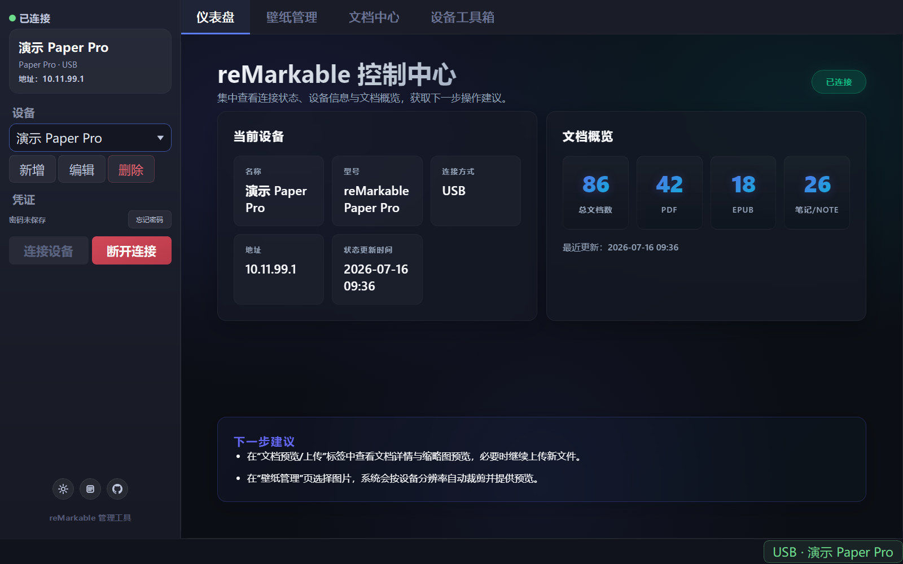
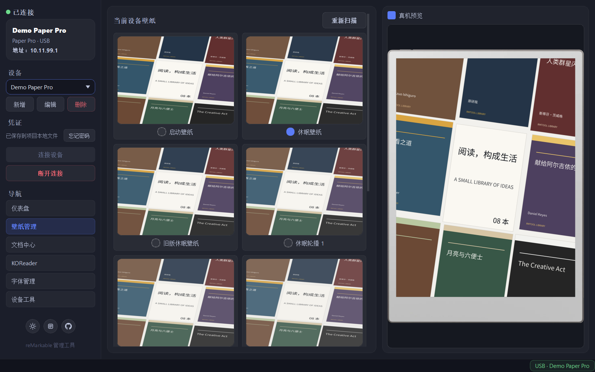
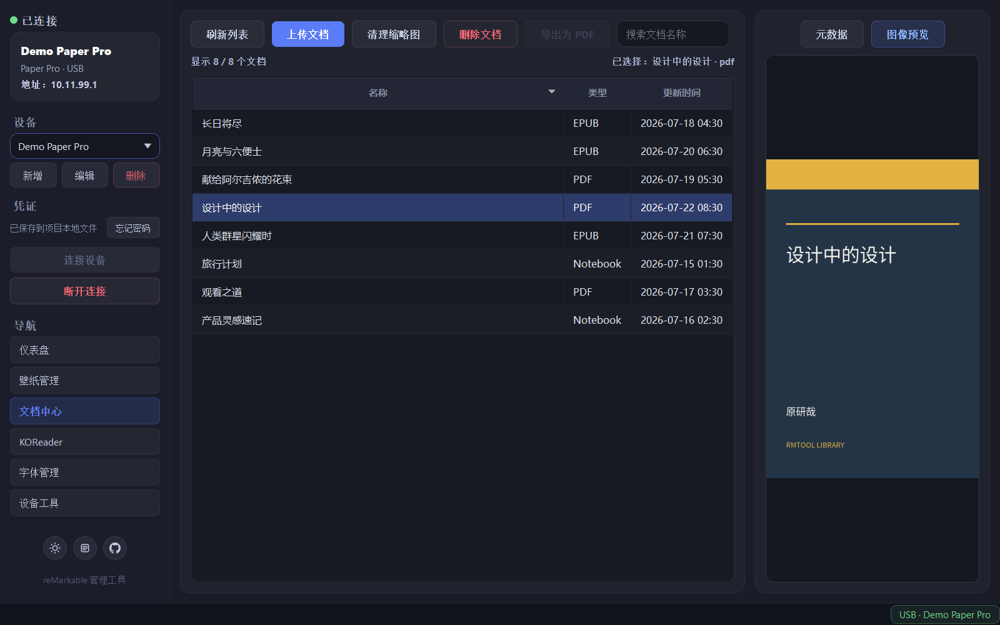
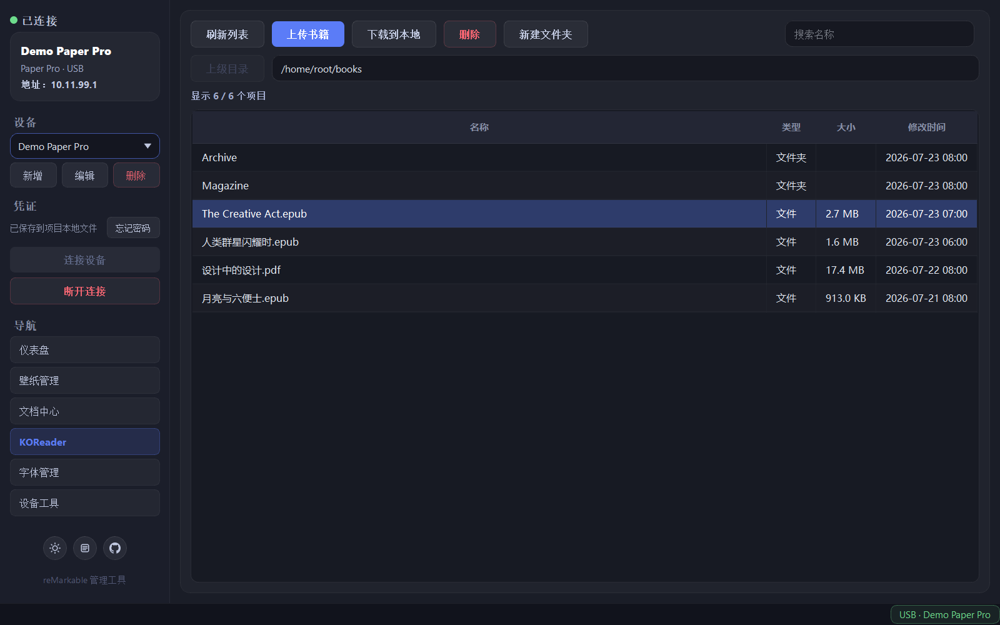
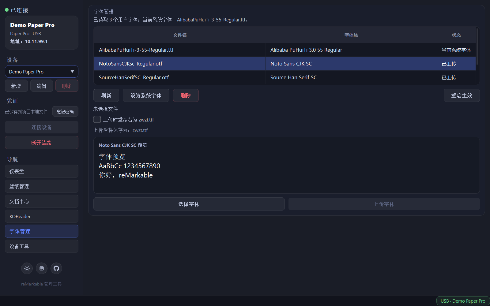
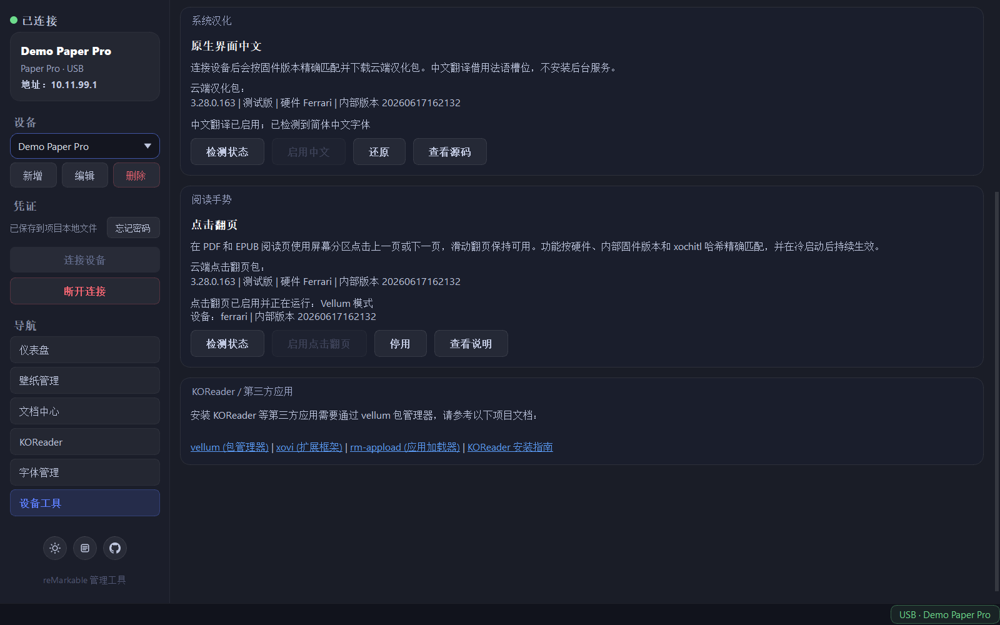

**[English](README.md) | 简体中文**

<div align="center">


# rmtool

面向 reMarkable 的桌面图形化管理工具

</div>

rmtool 通过本地 root SSH 管理 reMarkable Paper Pro、Paper Pro Move、Paper Pure、reMarkable 1 和 reMarkable 2，提供多设备连接、仪表盘、壁纸、文档、KOReader 书库管理、字体、时间、设备控制、原生界面中文、离线拼音输入，以及彩色设备按固件精确匹配的阅读增强等功能。设备操作不依赖 reMarkable 云服务；发布包内置这些固件功能的基础可信清单，可离线识别支持情况并复用已验证缓存。固件专用载荷不会打包进应用，仍需联网下载或使用已有的有效缓存。

> [!WARNING]
> rmtool 会直接修改设备文件。请先同步或备份重要内容，并确认自己能够承担开发者模式、root SSH 和第三方修改带来的数据与保修风险。本项目不是 reMarkable 官方软件。

## 软件截图

<table>
  <tr>
    <td width="50%" align="center">
      <a href="assets/screenshots/01-dashboard.png"></a><br>
      <sub><b>仪表盘</b></sub>
    </td>
    <td width="50%" align="center">
      <a href="assets/screenshots/02-wallpaper.png"></a><br>
      <sub><b>壁纸管理</b></sub>
    </td>
  </tr>
  <tr>
    <td width="50%" align="center">
      <a href="assets/screenshots/03-documents.png"></a><br>
      <sub><b>文档中心</b></sub>
    </td>
    <td width="50%" align="center">
      <a href="assets/screenshots/04-koreader.png"></a><br>
      <sub><b>KOReader 书库</b></sub>
    </td>
  </tr>
  <tr>
    <td width="50%" align="center">
      <a href="assets/screenshots/05-fonts.png"></a><br>
      <sub><b>字体管理</b></sub>
    </td>
    <td width="50%" align="center">
      <a href="assets/screenshots/06-toolbox.png"></a><br>
      <sub><b>设备工具箱</b></sub>
    </td>
  </tr>
</table>

## 下载与安装

普通用户建议直接从 GitHub Releases 下载下表中的最新版本，无需安装 Python。

| 平台 | 下载 | 说明 |
| --- | --- | --- |
| Windows x64 | [便携版 ZIP](https://github.com/pretenderlu/rmtool/releases/latest/download/rmtool-windows-x64.zip) | 解压后运行 `rmtool/rmtool.exe`，适合长期使用 |
| Windows x64 | [单文件 EXE](https://github.com/pretenderlu/rmtool/releases/latest/download/rmtool-windows-x64-onefile.exe) | 直接运行；首次和每次冷启动会稍慢 |
| macOS ARM64 | [Apple Silicon 应用](https://github.com/pretenderlu/rmtool/releases/latest/download/rmtool-macos-arm64.app.zip) | 仅支持 M 系列 Mac；解压后运行 `rmtool.app` |

发布包目前没有 Windows 代码签名或 Apple 公证。若 SmartScreen 或 Gatekeeper 阻止启动，请先核对文件确实来自本仓库 Release，再使用系统提供的单次放行方式；不要全局关闭系统安全保护。

macOS 版会把运行状态保存在 `~/Library/Application Support/rmtool/`，因此即使应用包位于只读或系统转移的位置，也能正常保存配置。

### 托管资源下载源

rmtool 管理的固件专用资源均使用两个固定来源。客户端优先访问腾讯云 COS，失败后自动回退 GitHub；清单和载荷每次都必须通过预期大小与 SHA-256 校验，无效响应不会覆盖已验证缓存。两个远端均失败时，程序依次使用此前验证过的缓存清单和应用内置基础可信清单；真正安装时仍必须在缓存中已有精确匹配且通过验证的载荷。

| 资源 | 腾讯云 COS（中国大陆优先） | GitHub 备用源 |
| --- | --- | --- |
| 原生界面汉化 | [COS 根目录](https://rmtool-localization-1254761827.cos.ap-shanghai.myqcloud.com/) | [`localization-assets`](https://github.com/pretenderlu/rmtool/releases/tag/localization-assets) |
| 独立简体中文 | [`native-chinese/`](https://rmtool-localization-1254761827.cos.ap-shanghai.myqcloud.com/native-chinese/) | [`native-chinese-assets`](https://github.com/pretenderlu/rmtool/releases/tag/native-chinese-assets) |
| 拼音输入法 | [`pinyin-input/`](https://rmtool-localization-1254761827.cos.ap-shanghai.myqcloud.com/pinyin-input/) | [`pinyin-input-assets`](https://github.com/pretenderlu/rmtool/releases/tag/pinyin-input-assets) |
| 阅读增强 | [`reading-enhancements/`](https://rmtool-localization-1254761827.cos.ap-shanghai.myqcloud.com/reading-enhancements/) | [`reading-enhancements-assets`](https://github.com/pretenderlu/rmtool/releases/tag/reading-enhancements-assets) |

## 连接设备

### SSH 前置条件

- 设备必须允许使用 `root` 账户通过 SSH 登录，并能查看当前 root 密码。
- Paper Pro、Paper Pro Move 和 Paper Pure 需要先启用 Developer Mode。启用会执行恢复出厂设置、清除设备上的本地数据并削弱设备安全性，请先同步或备份；具体流程与风险见 [reMarkable 官方说明](https://developer.remarkable.com/documentation/developer-mode)。reMarkable 1 和 reMarkable 2 不使用 Developer Mode，但仍需可用的 root SSH。
- USB 连接的默认地址是 `10.11.99.1`。设备通过 USB 接入电脑后，选择 USB 模式即可连接。
- Wi-Fi SSH 默认关闭。请先通过 USB 连接，再到“设备工具箱 > 设备控制”点击“开启 Wi-Fi SSH 通道”，随后把设备配置改为 WLAN 地址。
- Paper Pro 上的 root 用户名和密码可在 `General > Help > About > Copyrights and Licenses` 查看；其他型号或固件请以设备当前界面为准。

### 首次连接

1. 启动 rmtool，点击左侧“新增”，填写设备名称、连接方式、地址、型号和 root 密码。
2. 点击“连接”。首次连接会显示 SSH 主机指纹；确认是自己的设备后再选择信任。
3. 连接成功后，壁纸、文档、KOReader 和工具箱页面会自动启用。
4. 多台设备可以分别保存配置；切换到不同设备或地址时，现有 SSH 连接会自动断开。

## 本地数据与安全

rmtool 按运行平台将状态保存在以下目录：

| 运行方式 | 状态目录 |
| --- | --- |
| 源码运行 | 仓库根目录下的 `.rmtool/` |
| Windows 发布包 | `rmtool.exe` 或单文件 EXE 同级的 `.rmtool/` |
| macOS 发布包 | `~/Library/Application Support/rmtool/` |

主要文件包括：

- `devices.json`：设备列表、当前设备、主题、路径和日志面板设置。
- `known_hosts`：按设备 ID 隔离保存的 SSH 主机信任记录。
- `remarkable_tool.log`：滚动运行日志。
- `cache/localization/`：已校验的汉化清单和固件包缓存。
- `cache/reading-enhancements/`：已校验的阅读增强清单和固件包缓存。
- `cache/pinyin-input/`：已校验的离线拼音输入法包缓存。
- `cache/official/`：直接从 AppLoad 与 KOReader 官方 GitHub Release 下载并校验的缓存。

> [!CAUTION]
> 勾选“记住密码”后，root 密码会以**明文**写入上述状态目录中的 `devices.json`，不会进入系统凭据库。请勿分享、上传或把整个状态目录同步到不受信任的位置；提交 Issue 时也不要附带该目录。可在左侧点击“忘记密码”删除已保存密码。

## 当前功能

- **连接与仪表盘**：管理多个 USB/Wi-Fi 设备配置，校验 SSH 主机指纹；原生 Qt 仪表盘显示连接状态、设备信息、PDF/EPUB/笔记数量和下一步建议。
- **壁纸管理**：读取设备现有启动、休眠、轮播和关机壁纸预览；当前界面只按所选设备的原生分辨率生成竖屏壁纸，支持留白、裁剪和拉伸，裁剪时可调整水平/垂直偏移；还可把选中的文档缩略图配合可选文案，在电脑本地排版为封面墙壁纸，不会把文档数据发送到云端。
- **文档中心**：搜索和查看文档元数据、缩略图；批量上传 PDF/EPUB、检查剩余空间、批量删除；将单个文档中 `.rm` 或 `.note` 内可解析的手写笔迹导出为白底 PDF，不合并原 PDF/EPUB 页面。
- **AppLoad 与 KOReader**：在精确支持的正式版固件上，不经过 Vellum，直接从各自官方 GitHub Release 安装 AppLoad 和 KOReader。rmtool 会固定校验文件名、大小和 SHA-256，也支持导入用户自行下载的同一官方 ZIP，且不会自动重启设备。检测到旧 Vellum/AppLoad KOReader 目录时，会先完整备份，再把设置、历史、统计、截图等白名单用户数据迁移到全新的官方程序中，不会把未知旧程序文件混入新版本。3.28 系列测试版明确不支持。安装后可继续在书库管理器中搜索目录、传输书籍、新建文件夹和删除项目，所有操作均限制在检测到的书库根目录内。
- **字体管理**：预览并上传多个 TTF/OTF，可在上传时重命名为 `zwzt.ttf`；查看 `/home/root/.local/share/rmtool/fonts` 中的非活动字体，按精确文件路径切换系统界面字体，并删除未启用字体。上传字体在用户明确选择前不会进入 Fontconfig 默认扫描范围；只有当前选中的字体会原子复制到 `/data/rmtool/fonts`，供密码解锁前后的界面共同使用，根分区仅保存一个很小的 Fontconfig 配置。已有自定义字体目录继续受支持，不会被自动搬移。只有旧版根区镜像、rmtool 生成的 Fontconfig、文件元数据以及唯一 `/home` 原字体均精确匹配时，才会提供一键迁移，且无需重新上传字体。系统字体保留完整字形，并按替换完成后的实际空间判断；应用后 `/data` 至少保留 24 MiB，空间紧张时会先在 `/home` 备份并校验原镜像。界面会按精确设备与固件显示“已实机验证”“待实机验证”或“未实机验证”。上传不会自动切换字体或重启设备，重启由独立确认按钮执行。
- **时间管理**：同步电脑时间、查看系统时间/硬件时钟/时区，或设置为 `Asia/Shanghai`。
- **设备控制**：重启设备、开启 Wi-Fi SSH，以及为具有 `rm_frontlight` 前光接口的设备提升亮度并安装持久化服务。
- **阅读增强**：在精确支持的 Paper Pro 与 Paper Pro Move 3.27/3.28 固件上，增加一个原生设置页，统一控制点击翻页、快速黑白、周期清屏和按章节清屏；周期清屏可设置为每 5 至 30 次真实翻页。
- **离线拼音输入**：为系统软键盘和实体键盘增加设备端拼音候选栏，预测与词库完全留在本机，并与其他插件共享 rmtool 现有 Xovi 运行时。
- **主题与日志**：亮色/暗色主题会持久化；底部日志面板支持级别过滤、暂停、自动滚动、清屏和打开日志文件。

### 安装 AppLoad 与 KOReader

进入 KOReader 页面，连接设备后先点击**检测状态**。只有设备型号、内部固件版本、架构与原始 xochitl 哈希精确命中受支持的正式版条目时，安装按钮才会启用。先安装 AppLoad，再安装 KOReader；rmtool 关闭 SSH 后，从设备菜单手动重启。若检测到旧版 KOReader，用户可以选择**迁移并安装 KOReader**或**彻底清理旧版残留**：迁移会把未经修改的旧目录保存在 `/home/root/.local/share/rmtool/koreader-legacy-backup`；彻底清理会删除固定的旧 KOReader 应用目录及其中全部内容、不创建备份，完成后再由用户单独执行全新安装。在线安装分别从 [asivery/rm-appload Releases](https://github.com/asivery/rm-appload/releases) 和 [koreader/koreader Releases](https://github.com/koreader/koreader/releases) 下载；这两项应用资源不会打包进 rmtool、不会上传腾讯云 COS，也不会存放在 rmtool 仓库。网络不稳定时，可自行下载对应的官方 ZIP，再选择**加载本地官方包**。

### 壁纸注意事项

每次上传前，目标文件会复制为同目录的 `.backup`；再次上传会覆盖该备份。上传休眠壁纸 `suspended.png` 时，可让程序把设备现有 `carousel/*.png` 替换为透明图片，避免固件 3.27 的轮播插图遮挡自定义壁纸。轮播原图会首次备份到固件不会读取的 `carousel/.backup/` 子目录；关闭该选项时会从备份恢复，旧版本遗留在原图旁的备份也会迁移到该子目录。

### 原生界面中文

> [!IMPORTANT]
> 本功能（法语槽位替换法）已**停止扩展**：下方矩阵即最终支持清单，更新的固件不再加入。新固件（`3.28.0.166` 之后的测试版与未来正式版）的汉化由[独立简体中文插件](#独立简体中文插件)提供，走真正的 `zh_CN` 原生槽位，且可与法语共存。已有固件上的本功能继续可用。

发布包不内置任何固件专用 `.qm` 文件。点击“设备工具箱 > 系统汉化 > 检测状态”后，rmtool 会：

1. 优先从[腾讯云 COS 中国大陆镜像](https://rmtool-localization-1254761827.cos.ap-shanghai.myqcloud.com/manifest.json)获取清单，再尝试固定的 GitHub `localization-assets` Release；两者均不可用或内容无效时，依次使用已验证的本地缓存和应用内置的基础清单。
2. 按 `/etc/version` 的 14 位内部固件版本精确匹配。
3. 对设备原始法语载体文件 `reMarkable_fr.qm` 计算 SHA-256，据此选择对应硬件载荷；`chiappa`、`ferrari`、`tatsu`、`rm1`、`rm2` 等平台名仅用于显示，不用于猜测兼容性。
4. 校验下载大小和 SHA-256。固件、原始法语文件或校验值不匹配时，不会写入设备。

默认直接点击“启用中文”，rmtool 会依次从腾讯云 COS 镜像和 GitHub 下载精确匹配的汉化包；每次响应都必须通过清单规定的精确大小和 SHA-256 校验后，才能替换缓存并继续安装。网络不稳定时，可通过“获取汉化包”将匹配文件下载到电脑或复制 COS 直链，再用“加载本地汉化包”导入；本地文件同样必须通过当前设备对应的校验，验证后只写入电脑端缓存，随后仍由“启用中文”执行原有的安全部署流程。rmtool 发布包不会内置任何固件专用 `.qm` 载荷。

#### 当前汉化支持矩阵

“平台代号”是官方固件包内部使用的硬件标识，与各列所示的 14 位内部固件版本是两个不同概念。

| 设备型号 | 平台代号 | 3.27.1.0 正式版（`20260506100933`） | 3.27.3.0 正式版（`20260612085811`） | 3.28.0.162 测试版（`20260629074044`） | 3.28.0.163 测试版（`20260702125656`） | 3.28.0.164 测试版（`20260702125656`） | 3.28.0.166 测试版（`20260806095513`） | 3.28.0.169 测试版（`20260806095513`） |
| --- | --- | --- | --- | --- | --- | --- | --- | --- |
| reMarkable Paper Pro | `ferrari` | 支持 | 支持 | 支持 | 支持 | 支持 | 支持 | 支持 |
| reMarkable Paper Pro Move | `chiappa` | 支持 | 支持 | 支持 | 支持 | 支持 | 支持 | 支持 |
| reMarkable Paper Pure | `tatsu` | 暂不支持 | 支持 | 暂不支持 | 暂不支持 | 暂不支持 | 暂不支持 | 暂不支持 |
| reMarkable 1 | `rm1` | 暂不支持 | 支持 | 暂不支持 | 暂不支持 | 暂不支持 | 暂不支持 | 暂不支持 |
| reMarkable 2 | `rm2` | 暂不支持 | 支持 | 暂不支持 | 暂不支持 | 暂不支持 | 暂不支持 | 暂不支持 |

Paper Pro（`ferrari`）已在 3.28.0.162 和 3.28.0.163 完成真机启用与还原验证；3.28.0.164 两款设备包、Paper Pro Move（`chiappa`）测试版支持（含 3.28.0.166），以及 Paper Pro Move、Paper Pure（`tatsu`）、reMarkable 1（`rm1`）和 reMarkable 2（`rm2`）所列的 3.27.3 包，目前仅完成官方固件离线验证。3.28.0.163 与 3.28.0.164 的内部版本相同，rmtool 会继续使用原始法语目录的精确哈希区分，绝不会只看版本字符串猜测；3.28.0.169 与 3.28.0.166 的原始法语目录逐字节相同，汉化资产直接通用。实际可用范围以云端清单为准。详见 [汉化说明](translations/README.md) 和 [清单格式](translations/manifest.json)。

现有稳定汉化借用 xochitl 内置法语槽位，启用期间不能使用法语。程序会先备份原配置和原始 `reMarkable_fr.qm`，并检查当前主字体是否支持简体中文。reMarkable 1 和 reMarkable 2 的官方固件不含 CJK 字体，因此必须经过这项字体保底检查；缺少字体时可安装随应用提供的 Noto Sans CJK SC，或选择本地 TTF/OTF。字体原文件仍由 `/home` 管理，只有当前字体的一份校验副本保存在 `/data/rmtool/fonts`；根分区只持久化 `/etc/fonts/conf.d/99-rmtool-ui-font.conf`。因此加密 `/home` 尚未解锁时，密码界面也能使用同一字体，又不会用完整字体占满根分区。启用汉化、应用或修复字体、还原原始界面后，程序会关闭 SSH，且**不会自动重启设备**。启用中文后请手动重启，再进入“设置 > 语言”选择“法语”，中文界面才会正式显示；还原操作只需按提示重启。

#### 独立简体中文插件

精确构建插件可在保留法语的同时新增独立“简体中文”选项：

| 设备 | 3.27.1 正式版 | 3.27.3 正式版 | 3.28.162 测试版 | 3.28.163 测试版 | 3.28.164 测试版 | 3.28.166 测试版 | 3.28.169 测试版 |
| --- | --- | --- | --- | --- | --- | --- | --- |
| Paper Pro（`ferrari`） | 离线验证 | 离线验证 | 离线验证 | 离线验证 | 离线验证 | **实机验证** | 离线验证 |
| Paper Pro Move（`chiappa`） | 离线验证 | **实机验证** | 离线验证 | 离线验证 | 离线验证 | 离线验证 | 离线验证 |

Move 正式版包已通过实机安装、语言切换、重启和停用测试，并继续精确匹配官方 xochitl 哈希。该固件默认没有 CJK 字体，因此 rmtool 会在部署前确认当前系统字体支持简体中文；缺少字形时会在任何写入前停止，并引导用户先到字体管理设置系统字体。

独立插件不能和法语槽位汉化同时启用。无损迁移应分两步：先还原法语槽位汉化并手动重启；重新连接后，再启用独立简体中文插件并再次手动重启，最后选择“简体中文”。rmtool 故意保留两次明确操作，第二步失败时设备仍处于原生语言路径。

### 离线拼音输入

精确包现已覆盖 Paper Pro 与 Paper Pro Move 的 `3.27.1.0`、`3.27.3.0`、`3.28.0.162`、`3.28.0.163`、`3.28.0.164`、`3.28.0.166` 和 `3.28.0.169`。每个包同时校验硬件、架构、内部固件版本和 xochitl SHA-256；Paper Pro `3.28.0.166` 已通过实机验证，其余 13 个目标为官方固件离线验证。

本功能移植 [boangs/rmkit](https://github.com/boangs/rmkit) 中 GPL-3.0 的 QMLDiff 候选栏、小型输入 hook、`zh_CN` 键盘布局资源和本地 `rime-frost` 词库服务。只有启用拼音时，hook 和键盘资源才会加入 rmtool 共享 Xovi；所有精确版本的原生中文目录都负责把系统动态名称 `Chinese` 显示为“中文”，任何 QMD 都不接管键盘名称。词库服务保存在 `/home/root/.local/share/rmtool/pinyin-input`，启停会保留全部同伴插件，也不会重启 xochitl 或设备。旧包迁移严格限制在真实存在过的 Paper Pro `3.28.0.166` 版本，不会把旧版本规则错误套用到新目标。

### 阅读增强

阅读增强是 rmtool 当前唯一的阅读插件：使用一个固件精确包，并在设备原生设置中提供统一页面，用于控制点击翻页、快速黑白、周期整屏清屏和按章节清屏。rmtool 会同时匹配硬件平台、CPU 架构、内部固件版本和原始 `/usr/bin/xochitl` SHA-256；其他固件或被修改的构建不会通过猜测强行安装。旧版点击翻页和快速黑白包只作为安全迁移、清理的兼容性输入，不再作为独立功能安装。

| 设备型号 | 平台代号 | 3.27.1.0 正式版（`20260506100933`） | 3.27.3.0 正式版（`20260612085811`） | 3.28.0.162 测试版（`20260629074044`） | 3.28.0.163 测试版（`20260702125656`） | 3.28.0.164 测试版（`20260702125656`） | 3.28.0.166 测试版（`20260806095513`） | 3.28.0.169 测试版（`20260806095513`） |
| --- | --- | --- | --- | --- | --- | --- | --- | --- |
| reMarkable Paper Pro | `ferrari` | 官方固件离线验证 | 官方固件离线验证 | 官方固件离线验证 | 官方固件离线验证 | 官方固件离线验证 | 官方固件离线验证 | 官方固件离线验证 |
| reMarkable Paper Pro Move | `chiappa` | 官方固件离线验证 | **真机验证** | 官方固件离线验证 | 官方固件离线验证 | 官方固件离线验证 | 官方固件离线验证 | 官方固件离线验证 |

Move 3.27.3 已完成真机安装、重启、设置页导航和功能测试；其余 13 个目标均针对对应官方固件完成 qmd-tool 哈希检查、QMLDiff 兼容性、补丁回放、修改后 QML 断言、压缩包校验和确定性重建。

安装并手动重启设备后，可在“设置 > 阅读增强”中直接开关功能。点击翻页会保留原生滑动、手写笔、菜单、缩放、选区和文档链接；快速黑白只作用于 PDF/EPUB 阅读，清屏可设置为每 5 至 30 次真实翻页执行，或按章节边界执行，并且不会出现在笔记中。

安装、迁移、修复或停用与重启严格分离。rmtool 只写入并校验持久化配置，随后关闭 SSH，不会自动重启 xochitl 或设备。操作后应从设备菜单执行完整重启。启动器会在每次开机时校验设备身份和全部运行文件；任一项不匹配时会直接启动原生 xochitl。

阅读增强、原生简体中文和拼音输入统一共享 rmtool 自有 Xovi/QRR 运行时，同时保留各自的功能状态。检测到 Vellum/AppLoader 或非托管 Xovi 时会阻止安装，避免混合运行时。固件资源优先从腾讯云 COS 获取，失败后回退固定的 `reading-enhancements-assets` Release，并执行精确大小、SHA-256 校验和已验证缓存回退。“旧版插件迁移/清理”可把已验证的历史点击翻页、快速黑白包替换为当前固件精确包，同时保留同伴功能。rmtool 不会自行卸载 Vellum；清理已验证旧包后，请按 [Vellum CLI 官方卸载说明](https://github.com/vellum-dev/vellum-cli#usage) 操作。

## 使用建议

1. 连接后先在仪表盘确认当前设备和连接方式。
2. 壁纸页先“重新扫描”，选择设备实际存在的目标，再预览并上传。
3. 文档上传完成后，可按提示立即重启 xochitl；跳过时，新文档可能暂时不显示。
4. 删除文档不可撤销；导出 PDF 只对包含 `.rm` 或 `.note` 笔迹数据的单个文档可用，结果不包含原 PDF/EPUB 底图或非笔迹内容。
5. 字体和汉化属于设备级修改，完成后按提示重启设备。
6. 安装、迁移、修复或停用阅读增强后，等待 rmtool 关闭 SSH，再从设备菜单重启；不要把部署和远程立即重启 xochitl 放在同一个操作中。

## 常见问题

- **连接失败**：检查 USB 网络是否出现、地址是否为 `10.11.99.1`、root 密码是否为当前值，以及设备是否已允许 SSH。Wi-Fi 连接还需先通过 USB 开启 Wi-Fi SSH。
- **SSH 指纹变化**：系统更新、设备重置或地址被另一台设备复用都可能触发提示。先核对设备身份，不要在原因不明时直接重新信任。
- **壁纸目标不可用**：不同固件拥有的壁纸文件不同。点击“重新扫描”，改选有预览且未标记“当前设备不存在”的目标。
- **上传文档后设备端没显示**：回到文档中心重启 xochitl，或手动重启设备。
- **“导出为 PDF”不可用**：只能单选包含 `.rm` 或 `.note` 笔迹资源的文档；该功能只渲染可解析笔迹，不会合并原 PDF/EPUB 页面、键入文本或其他非笔迹内容。
- **汉化按钮不可用**：先点击“检测状态”。rmtool 可依次使用 COS、GitHub、已验证缓存或内置基础清单，但内部固件版本与设备原始 `reMarkable_fr.qm` 的 SHA-256 必须命中同一清单项。完全离线安装时，还需要已有通过校验的包缓存，或从本地导入匹配的汉化包。
- **无法安装阅读增强**：先点击“检测状态”。设备型号、固件、架构和原始 xochitl 哈希必须精确命中上表中的一项；被修改的载荷或混合 Xovi 布局会阻止部署。若检测到 Vellum，请先让 rmtool 只卸载其已验证的历史功能包，再按官方说明卸载 Vellum，重新检测后安装。
- **停用后阅读增强仍暂时有效**：这是正常现象，rmtool 不会强制结束当前 xochitl 进程。请从设备菜单完整重启，恢复原生界面。
- **AppLoad/KOReader 安装按钮不可用**：先在 KOReader 页面点击“检测状态”。这里只接受精确匹配的正式版固件，全部 3.28 测试版均被排除。旧版 KOReader 目录可以迁移，但 Vellum/Xovi 混合运行时或已经存在旧版完整备份时，仍会为安全起见拒绝修改。
- **macOS 无法创建配置**：确认当前用户可以创建并写入 `~/Library/Application Support/rmtool/`。
- **需要诊断信息**：点击左下角日志按钮，按级别筛选，或选择“打开日志文件”。分享日志前请检查其中是否含设备地址等隐私信息。

## 源码运行

建议使用与 Release 工作流一致的 64 位 Python 3.12；其他 Python 版本未由当前 CI 覆盖。

Windows PowerShell：

```powershell
python -m venv .venv
.\.venv\Scripts\Activate.ps1
python -m pip install -r requirements.txt
python rmtool.py
```

macOS：

```bash
python3 -m venv .venv
source .venv/bin/activate
python -m pip install -r requirements.txt
python rmtool.py
```

Windows 也可在依赖安装完成后双击 `rmtool.bat`，通过 `pythonw.exe` 启动而不保留控制台窗口。固定依赖版本见 [requirements.txt](requirements.txt)。

## 开发与发布检查

```bash
python -m compileall -q rmtool.py _dialogs.py _fast_mono_reading.py _log_viewer.py _pinyin_input.py _residue_migration.py _rmkit_cn.py _ssh.py _styles.py _tab_connection.py _tab_documents.py _tab_toolbox.py _tab_wallpaper.py _tap_page_turn.py _xovi_standalone.py rmrl tools tests
python -m unittest discover -s tests -v
git diff --check
actionlint .github/workflows/release.yml .github/workflows/sync-localization-assets.yml .github/workflows/sync-feature-assets.yml
```

Windows x64 本地构建运行：

```powershell
.\build-portable.ps1
```

脚本生成 `dist/rmtool-windows-x64.zip` 和 `dist/rmtool-windows-x64-onefile.exe`。macOS ARM64 应用由 [Release 工作流](.github/workflows/release.yml) 构建；推送 `v*` 标签后，工作流会在 Windows 与 macOS 测试、构建均成功时发布三个下载文件。

固定资源 Release 仍由 GitHub Actions 严格验证，但腾讯云 COS 镜像改为维护者在 Windows 本地发布。先安装 `cos-python-sdk-v5==1.9.44`，将 [.env.example](.env.example) 复制为已被 Git 忽略的 `.env`，填入仅限该存储桶的 CAM 凭据，然后运行：

```powershell
.\publish-cos.ps1
```

命令会将五个固定 Release 下载到临时目录，复用 Actions 的清单与载荷校验规则，只上传发生变化的载荷，在全部载荷成功后统一写入清单，最后从 COS 公网地址逐字节回读验证。无论成功或失败，临时目录都会自动清理。

## 贡献、许可与致谢

欢迎通过 [Issues](../../issues) 报告问题，或提交 [Pull Requests](../../pulls)。请勿在日志、截图或复现配置中提交设备地址、root 密码或 `.rmtool/` 内容。

本项目采用 [GNU General Public License v3.0](LICENSE)。译文与字体的第三方来源及许可见 [NOTICE.md](NOTICE.md)；主要来源如下：

- 中文翻译目录基于 [boangs/rmkit](https://github.com/boangs/rmkit) 的 GPL-3.0 内容适配。
- 内置手写笔记渲染器移植自 [rschroll/rmrl](https://github.com/rschroll/rmrl)，并使用 `rmscene` 解析新格式笔迹。
- 内置 Noto Sans CJK SC 来自 [notofonts/noto-cjk](https://github.com/notofonts/noto-cjk)，按 [SIL Open Font License 1.1](assets/fonts/LICENSE) 分发。
